# 📦 Universal Supply Chain & Forecast Analytics Data Warehouse

> **End-to-End Enterprise SQL Data Warehouse & BI Audit Across Pharma Cold-Chain, FMCG Fresh, Electronics & Personal Care**

---

## 📌 1. Short Description & Purpose

The **Universal Supply Chain & Forecast Analytics Project** is an enterprise-grade data audit executed on a 10-table relational data warehouse (`universal_supply_chain_db`). The primary objective is to evaluate multi-category logistics performance across four global geographical regions: **APAC (India), EU (Switzerland), NA (USA), and LATAM (Brazil)**. 

This project bridges complex SQL engineering (CTEs, Window Functions, Date Arithmetic, Conditional Aggregations) with executive BI dashboard visualizations to resolve cold-chain temperature spoilage, customer shipment delays, vendor OTIF SLA failures, and baseline demand forecasting errors.

---

## 🛠️ 2. Tech Stack

* **Database & Query Engine:** MySQL Workbench 8.0 (Relational Data Warehousing, SQL CTEs, Window Functions `DENSE_RANK()`, Aggregations)
* **Business Intelligence & Visualization:** Power BI Desktop (Conditional Formatting, Dual-Axis Combo Charts, SLA Target Lines)
* **Executive Presentation & Storytelling:** Canva 
* **Documentation & Version Control:** GitHub

---

## 🗄️ 3. Data Source

* **Enterprise Database Schema:** `universal_supply_chain_db` (Custom-Engineered 10-Table Star Schema Data Warehouse)
* **Data Architecture:** Custom Relational Logistics & Forecast Analytics Database Schema
* **Tables Audited:** `dim_products`, `dim_suppliers`, `dim_warehouses`, `fact_customer_shipments`, `fact_purchase_orders`, `fact_forecast_monthly`, `dim_date`, `fact_gross_price`, `fact_manufacturing_cost`, `fact_freight_cost`.

---

## 🎯 4. Features & Highlights 

### 🚨 Step 1: Business Problem
Global enterprise supply chain operations were suffering from four critical operational bottlenecks:
1. **Cold-Chain Inventory Spoilage Risk:** High-value bio-pharma vaccines and insulin were experiencing unmonitored transit temperature breaches (-25°C to 15°C safe bounds).
2. **Customer Fulfillment SLA Breaches:** Delivery delays were accumulating across regional fulfillment hubs (WH-BLR-01, WH-DEL-02, WH-ZUR-01).
3. **Supplier OTIF SLA Failures:** Vendor delivery delays and short shipments were creating stockout risks at regional warehouses.
4. **Demand Forecast Variance & Error Cancellation:** Net Error metrics were masking severe operational forecasting errors, causing warehouse over-stocking and stockouts.

---

### 🎯 Step 2: Dashboard & Project Goal
To transform global logistics operations across Pharma Cold-Chain, FMCG Fresh, and Electronics into a resilient, data-driven supply chain network—achieving zero inventory spoilage, eliminating customer delivery delays, maximizing supplier OTIF compliance above 80%, and standardizing Absolute Error (MAPE) for baseline demand forecasting.

---

### 📊 Step 3: Key Visuals & Chart Rationale

| Task / Analysis | Visual Type Selected | Design Rationale & Why Used |
| :--- | :--- | :--- |
| **Q1: Cold-Chain Catalog Audit** | **Horizontal Clustered Bar Chart** | Ranked high-value temperature-controlled SKUs by unit cost (INR) from highest (Human Growth Hormone ₹4.5K) to lowest (Milk ₹0.1K) for instant inventory valuation visibility. |
| **Q2: Customer Shipment Delays** | **Categorical Bar Chart by Hub** | Evaluated delivery delay duration in days across regional fulfillment hubs (Gurgaon, New York, Zurich), displaying max 3-day fulfillment bottlenecks. |
| **Q3: Temperature Breach Risk** | **Multi-Color Risk Bar Chart** | Applied conditional color rules (🔴 Critical Risk > ₹1.0M vs 🟠 Moderate Risk < ₹1.0M) to highlight that Insulin Glargine drove ₹4.63M (73%) of total exposure. |
| **Q4: Supplier OTIF SLA Audit** | **Horizontal Bar Chart + 80% SLA Target Line** | Overlayed a vertical dashed red target line at 80% OTIF SLA to visually separate performing vendors (🔵 ≥ 80%) from contract review vendors (🔴 < 80%). |
| **Q5: Top 2 SKUs Per Category** | **MySQL Result Grid Table** | Utilized a clean SQL Output Grid to present `DENSE_RANK() OVER(PARTITION BY category)` results cleanly without visual chart clutter. |
| **Q6: Forecast Accuracy & MAPE** | **Line & Column Combo Chart** | Combined downward negative Net Error bars (-1.5K) with a Golden Forecast Accuracy % Trend Line (92%–98%) to illustrate volume variance vs accuracy. |

---

### 💡 Step 4: Business Impact & Strategic Insights

* **❄️ Cold-Chain Exposure:** Identified **₹6.34 Million** in total inventory value at risk due to temperature excursions. **Insulin Glargine accounted for 73% of financial risk (₹4.63M)**, prioritizing real-time IoT temperature tracking on pharma delivery routes.
* **🚚 Customer Logistics:** Isolated fulfillment delays reaching up to **3 days** across Gurgaon, Zurich, and NYC distribution hubs, triggering 3PL courier SLA penalty enforcement.
* **📦 Supplier OTIF Performance:** Evaluated 100 purchase orders and **isolated 3 underperforming vendors failing the 80% OTIF benchmark** (LogiTech 0%, Pfizer 50%, Loreal 72.73%), enabling procurement contract renegotiations.
* **📈 Demand Forecasting Optimization:** Uncovered that while Net Error appeared low (-300 units) due to positive/negative error cancellation, **Absolute Error (MAPE) revealed true operational error of 900 units on Customer 70002017 and 3,500 units on Customer 70002019**, allowing planners to recalibrate safety stock models.

---

## 📸 5. Date Range & Dashboard Screenshots

**Date Period Analyzed:** Fiscal Year 2025 (12 Calendar Months)

**Visual Demonstration:**

##### **Cover Page Landing Portal**
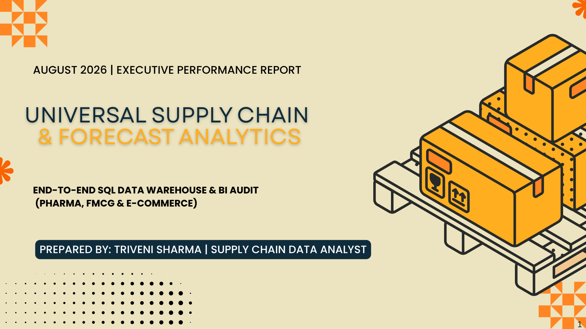

##### **Company Overview & Operating Scope**
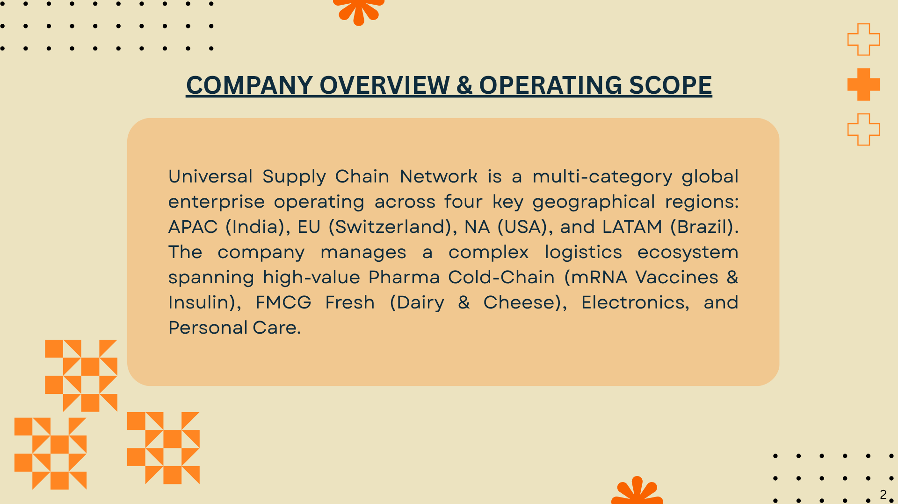

##### **Data Warehouse Architecture**
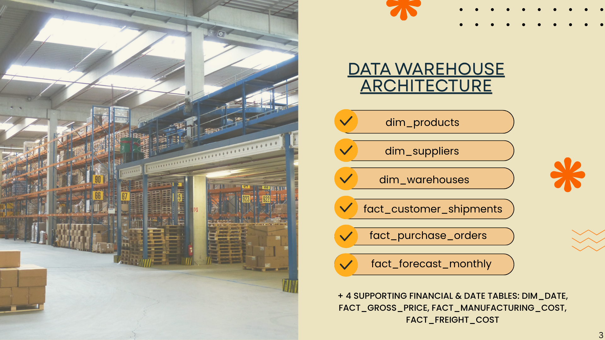

##### **Strategic Mission & Key Performance Goals**
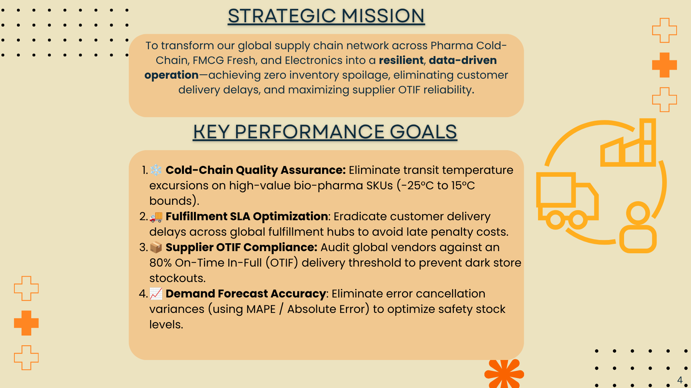

##### **Task 1: Cold-Chain Product Catalog Audit**
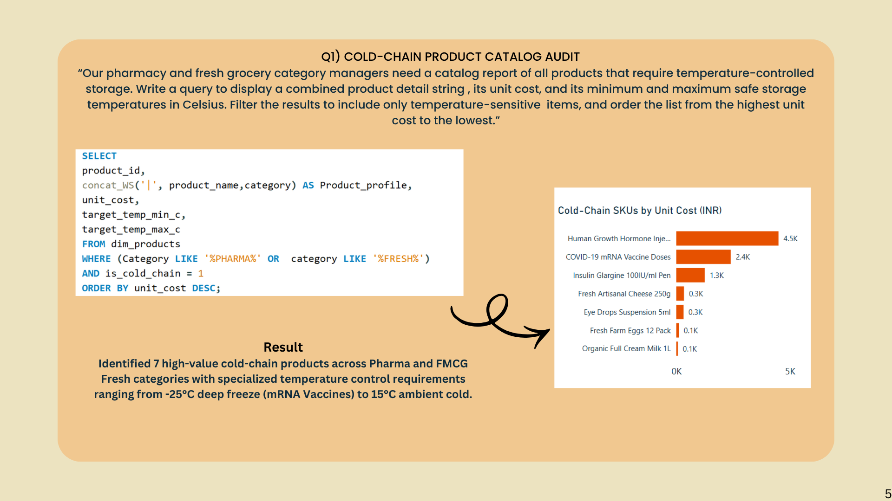

##### **Task 2: Customer Shipment Delay Analysis**
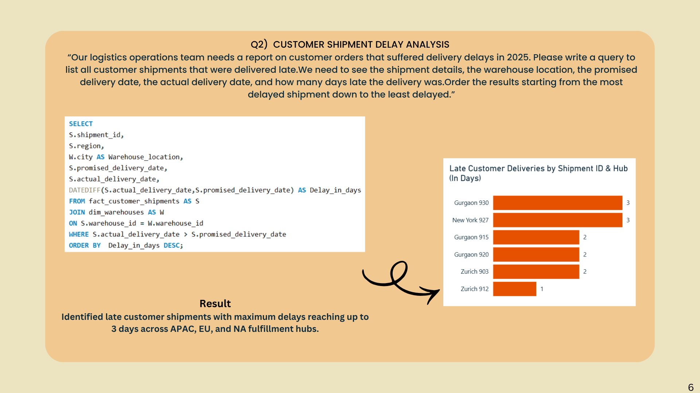

##### **Task 3: Cold-Chain Temperature Breach & Financial Risk Audit**
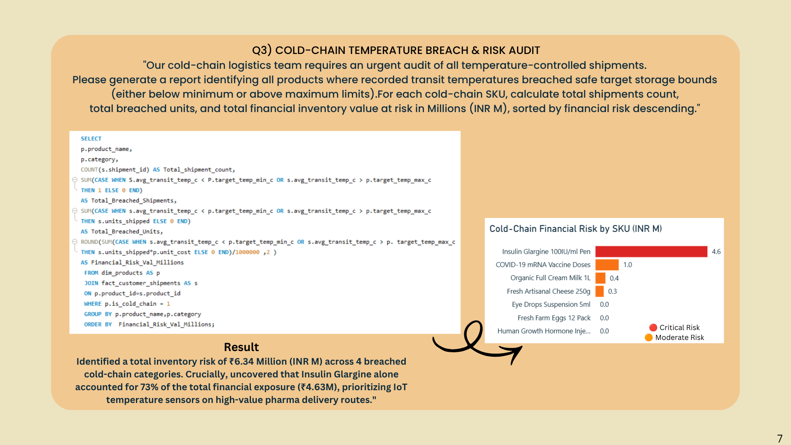

##### **Task 4: Supplier OTIF SLA Compliance Audit**
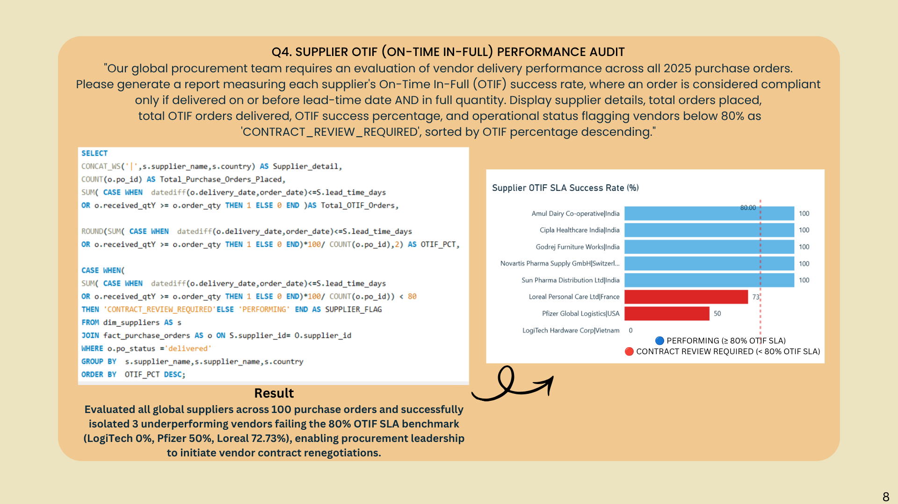

##### **Task 5: Top Product Volume Ranking Per Category**
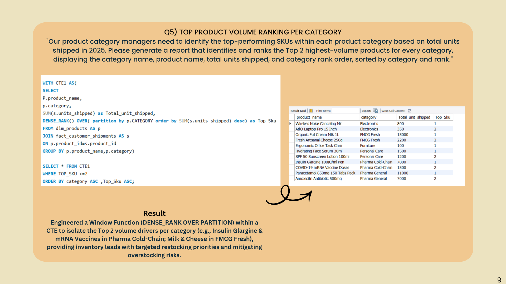

##### **Task 6: Customer Forecast Accuracy & MAPE Analysis**
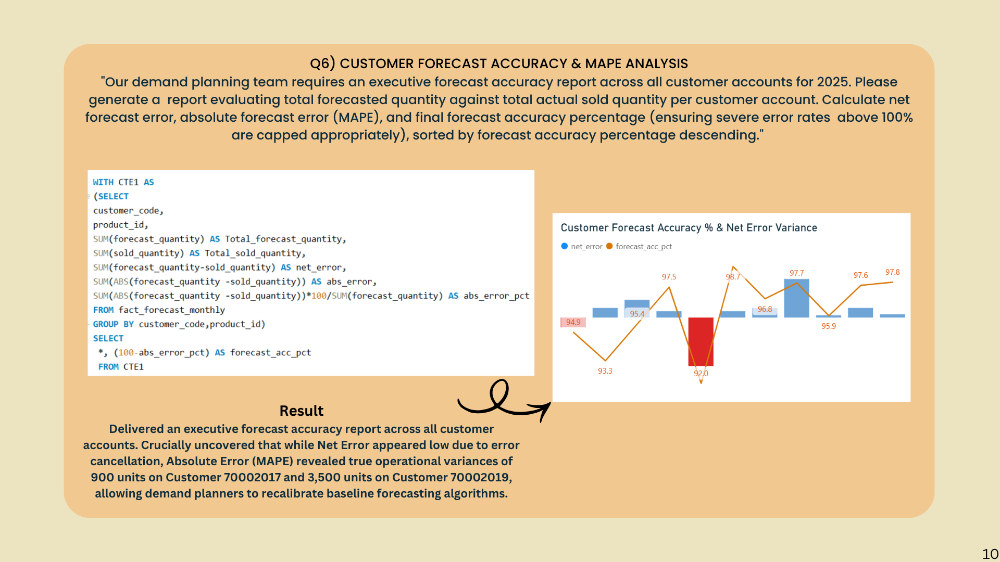

##### **Strategic Recommendations & Executive Summary**
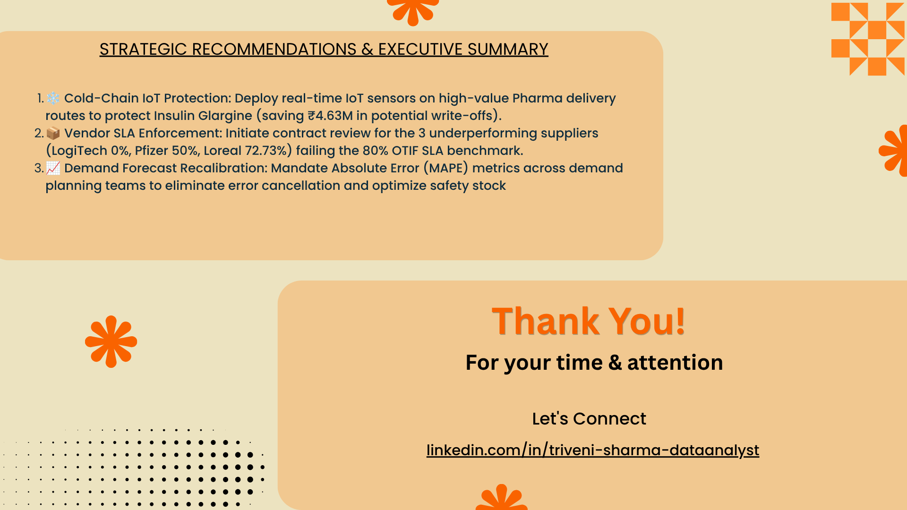

---

## 📄 Complete Presentation PDF & SQL Source Code

👉 **View & Download Complete Executive PDF Presentation (11 Pages):**  
📄 **[Click Here to Open / Download Complete Presentation PDF](https://github.com/ClinicalToCodeTS/universal-supply-chain-analytics/blob/main/AUGUST%202020%20EXECUTIVPERFORMANCE%20REPORT.pdf)**

---

## 🤝 Author & Connect
- **Developer:** Triveni Sharma
- **LinkedIn:** [Triveni Sharma](https://www.linkedin.com/in/triveni-sharma-dataanalyst/)
- **GitHub:** [Clinical2CodeTS](https://github.com/Clinical2CodeTS)

